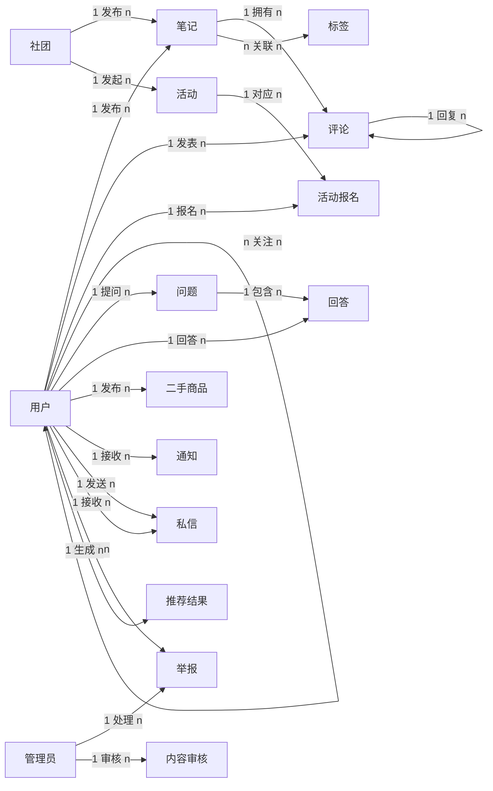

# BlueBook ER图（简版）

```mermaid
flowchart LR
    用户[用户]
    管理员[管理员]
    社团[社团]
    笔记[笔记]
    评论[评论]
    活动[活动]
    活动报名[活动报名]
    标签[标签]
    问题[问题]
    回答[回答]
    二手商品[二手商品]
    通知[通知]
    私信[私信]
    举报[举报]
    审核[内容审核]
    推荐结果[推荐结果]

    用户 -->|1 发布 n| 笔记
    社团 -->|1 发布 n| 笔记
    笔记 -->|1 拥有 n| 评论
    用户 -->|1 发表 n| 评论
    评论 -->|1 回复 n| 评论

    社团 -->|1 发起 n| 活动
    活动 -->|1 对应 n| 活动报名
    用户 -->|1 报名 n| 活动报名

    笔记 -->|n 关联 n| 标签
    用户 -->|n 关注 n| 用户

    用户 -->|1 提问 n| 问题
    问题 -->|1 包含 n| 回答
    用户 -->|1 回答 n| 回答

    用户 -->|1 发布 n| 二手商品
    用户 -->|1 接收 n| 通知
    用户 -->|1 发送 n| 私信
    用户 -->|1 接收 n| 私信

    用户 -->|1 发起 n| 举报
    管理员 -->|1 处理 n| 举报
    管理员 -->|1 审核 n| 审核

    用户 -->|1 生成 n| 推荐结果
```
